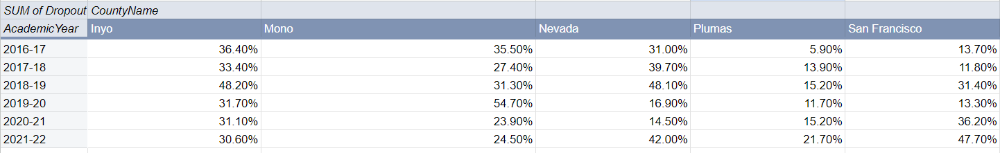

# J124-Final-Project: Data Analysis of Racial and Demographic Trends of High School Education in California, United States.  

This project is part of the course, **Introduction to Data Journalism (J124)** at the **University of California, Berkeley, Summer Sessions**. I would like to express my thanks to Professor Dana Amihere for all the guidance on this project. 

<h1>Project Description</h1>
In this project, I will be looking into Trends of Graduation and Dropout Rates across Race and Demography in the education system in California, United States. In doing so, I would be looking specifically into yearly Adjusted Cohort Graduation Rates(ACGR) of High Schools (Grades 9-12) of the Academic Years 2016-2017 to 2021-2022. Through this data, the Yearly Graduation and Dropout Rates across race and demography of schools across all School Districts and Counties in California are retrieved and compared for analysis.  

The data is from the California Department of Education and can be found here: [https://www.cde.ca.gov/ds/ad/filesacgr.asp](https://www.cde.ca.gov/ds/ad/filesacgr.asp).  

<h1>Interviewees</h1>  
At the end of the project, I hope to interview the following people whom I believe would find this project useful in allocating resources and implementing policies to help support to students in communities that may be racially or financially disadvantaged in their high school education.  
These people are the Superintedents / Board Members of the School Districts in the Top 5 Counties with the highest High School Dropout Rates in 2022.

1. Dr. Matt Wayne, Superintendent of San Francisco Unified School District
    *  Phone: (415) 241-6121
    *  Email: waynem@sfusd.edu
2. Scott W. Lay, Nevada County Superintendent of Schools
    *  Phone: (530) 478-6400
    *  Email: lscott@nevco.org
3. William Roderick, Plumas County Superintendent of Schools
   * Phone: (530) 283-6500
4. Stacey Adler, PH.D, Mono County Superintendent of Schools
   * Phone: (760) 934-0031
   * Email: sadler@monocoe.org
5. Chris Langley, President of 
Inyo County Board of Education
   * Phone: (760) 873-3262

<h1>Data Pre-processing</h1>  
Due to the large number of School Districts and Schools in California, I will be looking at the Data of the Adjusted Cohort Graduation Rates aggregated by Counties. As I am measuring the data across all schools in California, Schools that are both in and not in the Dashboard Alternative School Status Program (DASS) as well as both Charted and Non-Chartered Schools will be included in the analysis.

As the data files are separated by each Graduation Year on the website, they are all individually downloaded, filtered and merged on Excel, before importing them into Google Sheets for further Data Analysis.

Based on the above-stated conditions, the data is filtered as such using Power Query on Excel:
* "AggregateLevel" Column = "C": To filter rows that are only aggregated by the level of Counties.
* "DASS" = "All": To filter rows that contain schools that are both in and not in DASS.
* "CharterSchool" = "All": To filter rows that contain school that are both Charted and Non-Chartered.

Next, the datasets from Academic Year 2016-2017 to 2021-2022 are combined together to form a single Dataset, named _2017-2022 (County)_.  
In addition to the filtering, "%" units are also added to the columns of the Graduation Rates, Still Enrolled, and Dropout Rates.

_Pre-processing of Data on Excel Power Query_  

As Google Sheets is not able to handle the size of the data, two Googele Sheet Files are created in my analysis. They are as follows:
* [ACGR](https://docs.google.com/spreadsheets/d/1zc8FEzi5wkwPSBJD1SgmVf1vp_lN6pdns5f7aXnaASc/edit?usp=sharing): Looks at the general broad Overview of the data.
* [ACGR Dropout Rates](https://docs.google.com/spreadsheets/d/1wkpduouZsWpbPY3YoUNc3CZhI6z2E4JB492esOP2N-8/edit?usp=sharing): Focuses on the Dropout Rates.

Before the analysis, it is noted that the column "ReportingCategory" in the data contains short form acronyms to represent various Reporting Categories of Racial, Demographic and Gender Subgroups. The details of the acronyms can be seen [here](https://www.cde.ca.gov/ds/ad/fsacgr.asp).  
To make visualizations clearer and prevent any ambiguity, another column is created to show the Reporting Categories in their full wording. This is done on the [ACGR Dropout Rates](https://docs.google.com/spreadsheets/d/1wkpduouZsWpbPY3YoUNc3CZhI6z2E4JB492esOP2N-8/edit?usp=sharing) Google Sheet only.  
To do this, I first created a separate sheet in the Google Sheet to map the acronyms in the data to their full wordings.  
  
_Reporting Categories Table_  
  
Afterwards, I created another column, _ReportingCategory(long)_, in the data using the function:  
 _=VLOOKUP(K2, 'Reporting Categories'!$A$1:$B$21, 2, FALSE)_  
Where K2 refers to the reporting category in the second row in the data.  
  
_New Column in the data, ReportingCategory(long)_  
  
This column would be used for the visualization of data within Google Sheets.

<h1>Data Visualization</h1>  
Before anything else, let us visualize how the High School Dropout Rates vary across Counties in California.  
By plotting the Graduation rates of each County in 2022 onto a Chlorepeth, the following visualization is obtained:

   
[Link to Data Visualization on Datawrapper](https://datawrapper.dwcdn.net/ROyZZ/5/)

From the Chlorepeth, we can see some interesting patterns in the Dropout Rates. Majority of the Counties that had high Dropout Rates are further inland, except for San Francisco.

<h1>Analysis Questions</h1>

**Question 1. What are the Top 5 Counties that had the highest Dropout Rates in 2022?**  

_Methodology_  
1: A pivot table is created from the data on a separate sheet, named  _County GDE_ (stands for Graduation, Dropout and Enrolment). This sheet is created in [ACGR](https://docs.google.com/spreadsheets/d/1zc8FEzi5wkwPSBJD1SgmVf1vp_lN6pdns5f7aXnaASc/edit?usp=sharing).  
In addition to looking at the Top 5 Counties by Dropout Rate, the Graduation Rate and Proportion of Students still enrolled are included as well for a more comprehensive analysis.  
2: The settings of the Pivot Table are set as such:  
   *  Rows: CountyName, Sort by Dropout Rate in Descending Order
   *  Values:
      * Regular HS Diploma Graduates (Rate)
      * Dropout (Rate)
      * Still Enrolled (Rate)
   *  Filters:
      * Academic Year: 2021-2022
      * ReportingCategory: TA (means total)  

  
_Pivot Table of Counties with highest Dropout Rates in 2022_  

**Answer:**  
The Top 5 Counties with the highest Dropout Rates in 2022 are as follows (from highest to lowest): San Francisco, Nevada, Inyo, Mono, Plumas. This aligns with the Chlorepeth from earlier which shows that the Pivot Table is correct.

**Question 2. For the Top 5 Countries with the highest Dropout rates in 2022, how did the dropout rates vary from 2017 to 2022? Which country of the 5 had a significant increase in Dropout Rates after 2019(after Covid 19 Pandemic)?**  

_Methodology_  
1. Create a Pivot Table from the data on a separate sheet, named County Yearly Dropout. This sheet is created in [ACGR](https://docs.google.com/spreadsheets/d/1zc8FEzi5wkwPSBJD1SgmVf1vp_lN6pdns5f7aXnaASc/edit?usp=sharing).
2. The settings of the Pivot Table are set as such:
   *  Rows: Academic Year
   *  Columns: County Name
   *  Values: 
      * Dropout (Rate)
   *  Filters:
      * ReportingCategory: TA (means total)
      * Count Name: Inyo, Mono, Nevada, Plumas, San Francisco

     
   _Pivot Table of Annual Dropout Rates from 2017 - 2022 of Top 5 Counties with highest Dropout Rates in 2022_    

3.  Create a line chart with the pivot table, with the Academic Year as the X-axis, and a series for each County.

 **Answer:**  
     
   _Dropout Rates of Top 5 Counties from 2017-2022_  

   Ironically, most of the 5 countries had a decrease in Dropout Rates between 2018-2019 to 2019-2020, except Mono which had a significant increase in Dropout rates in that period.  
   This is not expected because I would have thought the opposite. Due to the Covid-19 Pandemic which occurred at the start of 2020, I hypothesized that the Pandemic would negatively expect High School Education and cause an increase in High School Dropout Rates. The general decrease in Dropout Rates between 2018-2019 and 2019-2020 suggests that the Pandemic has had a positive impact on High School Education, and this may be due to remote learning being a more efficient way of teaching than traditional classes.  
   Following up from 2019-2020, it is worth noting that the Dropout rates of San Francisco County gradually increased from 2019-2020 to 2021-2022. This is interesting as it may suggest that, despite the decrease in Dropout Rates after the Pandemic, the event might have negatively affected education in the High Schools in the Bay area, causing a consecutive increase in Dropout Rates for 2 years after 2020.  

**Question 3. For the Top 5 Countries with the highest Dropout rates in 2022, how did the Dropout Rates vary across Race from 2017 to 2022?**   

_Methodology_  
1. Create a Pivot Table from the data on a separate sheet, named Race Yearly Dropout. This sheet is created in [ACGR Dropout Rates](https://docs.google.com/spreadsheets/d/1wkpduouZsWpbPY3YoUNc3CZhI6z2E4JB492esOP2N-8/edit?usp=sharing).
2. To answer this question, I created a Pivot Table and Chart for each of the Top 5 Counties from Question 1. The settings of the Pivot Table for San Francisco, for example, are set as such:
   *  Rows: Academic Year
   *  Columns: ReportingCategory(long)
   *  Values: 
      * Dropout (Rate)
   *  Filters:
      * ReportingCategory: RB, RI, RA, RF, RH, RD, RP, RT, RW (Refers to all racial subgroups)
      * County Name: San Francisco  

     
   _Pivot Table Yearly Dropout Rates by Race_  

3. Create a line chart with the table, with the Academic Year as the X-axis, and a series for each individual reporting category (African America, Asian, White, etc).

4. Repeat steps 2 and 3 for the other 4 counties.

**Answer:**  
The charts of Dropout Rates by Race for each of the Top 5 Counties from 2017-2022 are as follows:  
  
  
_Dropout Rates across different Races in San Francisco County from 2017-2022_   

  
_Dropout Rates across different Races in Nevada County from 2017-2022_  

  
_Dropout Rates across different Races in Inyo County from 2017-2022_  

  
_Dropout Rates across different Races in Mono County from 2017-2022_  

  
_Dropout Rates across different Races in Plumas County from 2017-2022_  

From the charts, it can be observed that African Americans, Hispanics, Latinos, and Asians are the races that generally have higher dropout rates.  
It is also worrying to realize that for San Francisco County and Nevada County, the Dropout Rates of some Racial Groups were above 50%. **This means that more than half of the students of some races dropped out of High School in San Francisco and Nevada**.  
For San Francisco, 78.9% of African American Students dropped out of High School in 2022. There may be higher rate dropout rates for other races in San Francisco as students, whom Race was unreported, had a dropout rate is 63.7%.  
For Nevada, the dropout rates were 68.2% for Hispanics and Latinos, 53.8% for Asian and 52.8% for African American.  

**Question 4. For the Top 5 Countries with the highest Dropout rates in 2022, how did the Dropout Rates vary across Demographic Background (Homeless, Disabilities, English Learners, etc) from 2017 to 2022?**  

_Methodology_  
The Methodology for this question is similar to Question 3, just that the Filters for Reporting Categories are the Demographic Categories instead.
1. Create a Pivot Table from the data on a separate sheet, named Demographic Yearly Dropout. This sheet is created in [ACGR Dropout Rates](https://docs.google.com/spreadsheets/d/1wkpduouZsWpbPY3YoUNc3CZhI6z2E4JB492esOP2N-8/edit?usp=sharing).
2. To answer this question, I created a Pivot Table and Chart for each of the Top 5 Counties from Question 1. The settings of the Pivot Table for San Francisco, for example, are set as such:
   *  Rows: Academic Year
   *  Columns: ReportingCategory(long)
   *  Values: 
      * Dropout (Rate)
   *  Filters:
      * ReportingCategory: SE, SD, SS, SM, SF, SH (Refers to all Demographic subgroups)
      * County Name: San Francisco  
   
3. Create a line chart with the table, with the Academic Year as the X-axis, and a series for each individual reporting category (African American, Asian, White, etc).

4. Repeat steps 2 and 3 for the other 4 Counties.

 **Answer:**  
The charts of Dropout Rates by Demographic for each of the Top 5 Counties from 2017-2022 are as follows:  
  
  
_Dropout Rates across different Demographics in San Francisco County from 2017-2022_  

  
_Dropout Rates across different Demographics in Nevada County from 2017-2022_  

  
_Dropout Rates across different Demographics in Inyo County from 2017-2022_  

  
_Dropout Rates across different Demographics in Mono County from 2017-2022_  

  
_Dropout Rates across different Demographics in Plumas County from 2017-2022_  

From the charts, it can be seen that Homeless, Socioeconomically Disadvantaged, and English Learners were the Demographic Categories which generally had the highest Dropout Rates among the 5 Counties. 

A particular County that stands out here is Nevada County. While homeless students had the highest dropout rates for San Francisco, Inyo, Plumas and Mono Counties, Nevada did not. Instead, the Demographic Categories that had the highest Dropout Rates in Nevada were English Learners, Socioeconomically Disadvantaged and Foster students. This means that Nevada County had problems that were very different from the other four Counties. The students who struggled with High School in Nevada are likely to previously be of an unfortunate background but had received governmental or social support. Perhaps support and resources provided to High Schools in Nevada could be channelled towards Foster Homes, and lower-income families, to support students in these communities in their High School Education.

**Question 5: For the Top 5 Countries with the highest Dropout rates in 2022, which County had the highest Proportion of Students who are still enrolled after Senior Year and which County had the lowest graduation rate?**   

_Methodology_  
1. Create a pivot table from the data on a separate sheet, named as 2022 GDE (stands for Graduation, Dropout and Enrolment). This sheet is created in [ACGR](https://docs.google.com/spreadsheets/d/1zc8FEzi5wkwPSBJD1SgmVf1vp_lN6pdns5f7aXnaASc/edit?usp=sharing). The settings of the Pivot Table are set as such:
   *  Rows: CountyName
   *  Values:
      * Regular HS Diploma Graduates (Rate)
      * Dropout (Rate)
      * Sill Enrolled (Rate)
   *  Filters:
      * Academic Year: 2021-2022
      * Reporting Category: TA (Refers to Total)
      * Count Name: Inyo, Mono, Nevada, Plumas, San Francisco
     
_Pivot Table of Graduation rate, Dropout Rate, and Proportion of Students that are still enrolled after senior year._  
2. Create a stacked column chart from the pivot table with X-axis as the County name and 3 series for the Regular HS Diploma Graduation rate, Dropout and Still Enrolled Rates.

**Answer:**  
  
_Graduation rate, Dropout Rate, and Proportion of Students that are still enrolled after senior year of Top 5 Counties in 2022_  

From the chart, it can be seen that Mono has the Highest Proportion of Students who were still enrolled after their Senior Year, and also the lowest Dropout Rate in 2022. This means that despite the low Graduation Rates, measures may have been taken by the School Districts of Nevada County to retain Students who did perform well in their Senior Year to give them a chance to graduate from High School the next year. It positively reflects on the effort by Nevada County to ensure that despite challenges in learning, sociocultural and demographic backgrounds, a second chance is given to these students to stay enrolled in High Schools to ensure a better chance of Graduating in the next year.

<h1>Story Pitch</h1>

**What Educational Policies and Resources can be implemented to which Communities in the 5 Counties to improve the High School Education of those Counties?**  
The data reflects on the various challenges faced by the Education System in the Top 5 Counties that had the highest dropout rates in 2022. Due to the decrease in dropout rates between Academic Year 2018-2019 and 2019-2020, it may be evident that remote learning is an effective form of education for High School Students. Looking at the Racial and Demographic Trends in the Dropout Rates of the 5 Counties, Financial Aid and Support could be given to Communities that consisted of the Racial and Demographic Categories that had generally high High School Dropout Rates. For Races, they were African Americans, Hispanics, Latinos, and Asians, while for Demographic Categories, they were Homeless, Socioeconomically Disadvantaged, and English Learners.  
  

Looking at the individual Counties, Nevada County and San Francisco County stood out to be in need of support to help students of various categories to Graduate from High School. More than half of Hispanics and African Americans in San Francisco as well as Asian, Hispanic/Latino and African Americans in Nevada County dropped out of High School in 2022, which is a worrying concern. In addition, it is noteworthy to see that San Francisco had a consecutive increase in High School Dropout rates from 2020 to 2022, suggesting that a certain weakness in the Education System of San Francisco County, which may be caused by the Pandemic, needs to be addressed. In channelling support to students of lower demographic backgrounds, it is important that it is channelled towards Foster Homes, and lower-income families in Nevada County, as these Students had the highest Dropout Rates in 2022. Finally, in using Mono County as a role model, support can be given for Students, who did make it through the final year, to stay enrolled so as to ensure that they can eventually Graduate.  

